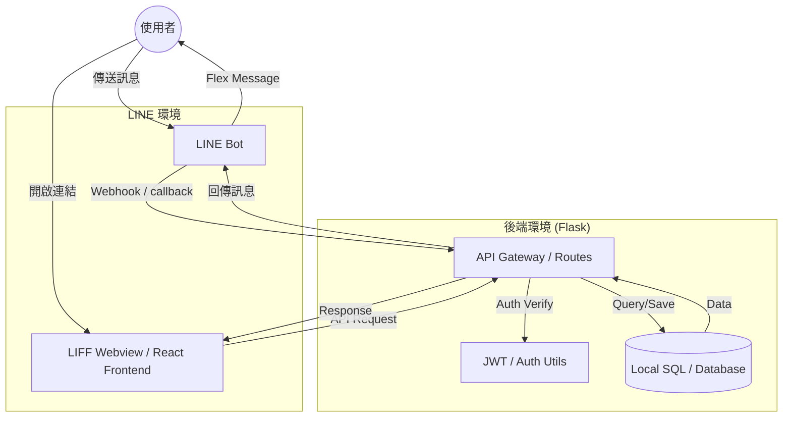
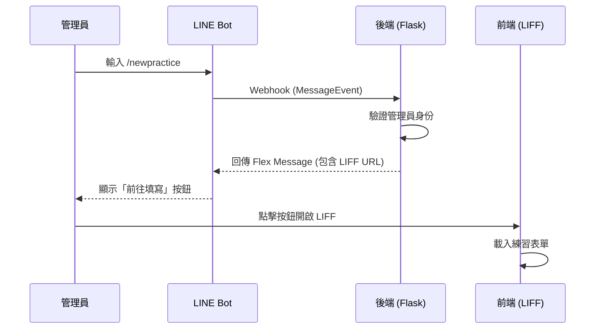
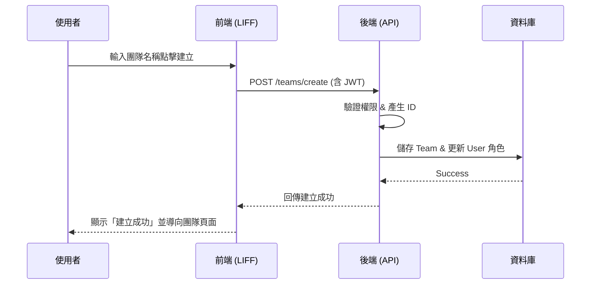
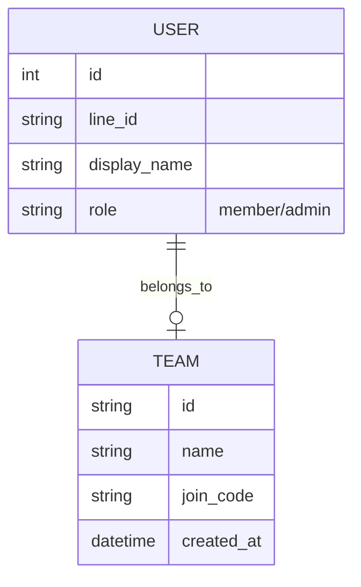

# 系統設計文件 (System Design)

本文件使用圖表輔助說明系統架構與關鍵業務流程。

## 1. 系統架構圖 (System Architecture)

系統採用前後端分離架構，前端 LIFF 崁入於 LINE App 中，後端 Flask 提供 API 服務。

## 2. 關鍵時序圖 (Sequence Diagrams)

### A. 管理員發起練習流程
當管理員在群組輸入 `/newpractice` 時的流程：

### B. 團隊建立與加入流程
使用者透過 LIFF 介面操作：

## 3. 資料模型設計 (Entity Relationship)

主要實體之間的關聯：

